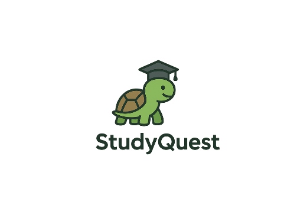

<div align="center">
  
  <h1>StudyQuest</h1>
  <h3><em>Transforming Education into an Epic Gaming Adventure</em></h3>
</div>


---

## Welcome to StudyQuest

The first main obstacle students face while trying to learn a new topic is **not having progress visibility**, **overwhelming huge textbooks**, and **pushing assignments to the last minute**. 

**StudyQuest solves all these problems** and has even more features to keep students engaged while studying. With **streaks** and **daily missions** that take less than 2 minutes, we keep students learning and staying in the loop, encouraging them to log into StudyQuest every day.

Students can **earn badges** and **climb leaderboards** in their class to compete with other students. Engaging quizzes with timers and great reward systems motivate students to work harder and make learning more fun than ever.

**Gamification of education has never been easier** with the help of **OpenAI's GPT-4** and an **agentic approach**. Teachers can simply upload their syllabus and generate a complete weekly plan with personalized quizzes and educational content with just a few clicks. Teachers can also upload videos and provide valuable links to students.

With the power of AI, we generate clear analytics on student performance, showing where they are strong and where they need more focus.

---

## Key Features

### For Students: The Ultimate Learning Adventure

| Feature | Description | Impact |
|---------|-------------|---------|
| **Interactive Level Maps** | Navigate through weekly content as unlockable game levels | Visual progress tracking |
| **Daily Missions** | Complete 3 daily tasks: Login, Answer Questions, Reflect | Consistent engagement |
| **Achievement System** | Earn 8+ unique badges for different accomplishments | Motivation & recognition |
| **Streaks & XP** | Build learning streaks and earn experience points | Habit formation |
| **Boss Battles** | Epic midterm and final exam experiences | High-stakes engagement |
| **Leaderboards** | Compete with classmates in real-time | Healthy competition |
| **Smart Cards** | Swipeable content cards, flip vocabulary cards | Bite-sized learning |
| **Timed Quizzes** | Engaging assessments with instant feedback | Active learning |

### For Teachers: AI-Powered Course Creation

| Feature | Description | Impact |
|---------|-------------|---------|
| **AI Course Generation** | Upload syllabus → Get complete course structure | 10x faster setup |
| **Smart Content Creation** | AI generates study materials, practice problems, quizzes | Comprehensive resources |
| **Student Management** | Easy enrollment, progress tracking, analytics | Complete oversight |
| **Performance Analytics** | Detailed insights into student strengths/weaknesses | Data-driven teaching |
| **Custom Missions** | Create personalized daily challenges | Targeted engagement |
| **Video Integration** | Upload and manage instructional videos | Blended learning |

---

## Technical Architecture

### Modern Tech Stack
```
Frontend: Next.js 14 + TypeScript
Styling: Tailwind CSS + Framer Motion
Auth: Custom Firestore Authentication
Database: Firebase Firestore
AI: OpenAI GPT-4 API
Icons: FontAwesome
```

### Project Structure
```
StudyQuest/
├── app/
│   ├── student/           # Student portal pages
│   ├── teacher/           # Teacher portal pages
│   ├── api/              # OpenAI & Firebase APIs
│   └── (auth)/           # Authentication pages
├── components/
│   ├── student/          # Student-specific components
│   ├── teacher/          # Teacher-specific components
│   └── shared/           # Shared components
├── services/             # Firebase & AI services
├── interfaces/           # TypeScript definitions
└── contexts/            # React context providers
```

### AI Integration Workflow
1. **Syllabus Upload** → AI analyzes document structure
2. **Content Generation** → Creates comprehensive educational materials
3. **Question Generation** → Produces varied assessment types
4. **Progress Analysis** → Provides learning insights

---

## Quick Start Guide

### Prerequisites
- Node.js 18+ and npm
- Firebase project with Firestore
- OpenAI API key

### Installation

1. **Clone the repository**
```bash
git clone https://github.com/yourusername/studyquest.git
cd studyquest
```

2. **Install dependencies**
```bash
npm install
```

3. **Environment Setup**
Create `.env.local` with:
```env
NEXT_PUBLIC_FIREBASE_API_KEY=your_firebase_api_key
NEXT_PUBLIC_FIREBASE_AUTH_DOMAIN=your_project.firebaseapp.com
NEXT_PUBLIC_FIREBASE_PROJECT_ID=your_project_id
NEXT_PUBLIC_FIREBASE_STORAGE_BUCKET=your_project.appspot.com
NEXT_PUBLIC_FIREBASE_MESSAGING_SENDER_ID=your_sender_id
NEXT_PUBLIC_FIREBASE_APP_ID=your_app_id

OPENAI_API_KEY=your_openai_api_key
```

4. **Start development server**
```bash
npm run dev
```

5. **Visit** `http://localhost:3000` and start your quest!

---

## Design System

### Color Palette
- **Quest Blue**: Primary student theme
- **Quest Fire**: Teacher portal accent
- **Success**: Completed tasks & achievements  
- **Danger**: Critical actions & errors
- **Purple**: Special features & daily missions

### UI Components
- **Rounded Game Borders**: Modern, friendly appearance
- **Framer Motion**: Smooth animations throughout
- **Responsive Design**: Works on all devices
- **Custom Tooltips**: Helpful guidance everywhere

---

## Gamification Elements

### Badge System
| Badge | Requirement | Reward |
|-------|-------------|---------|
| First Steps | Complete first week | Recognition |
| Streak Master | 7-day streak | Special status |
| Half Way Hero | 50% course completion | Milestone reward |
| Point Collector | 1000+ XP earned | Exclusive badge |
| Speed Demon | Fast completion times | Speed recognition |
| Perfectionist | 5 consecutive weeks | Excellence badge |
| Course Champion | Complete entire course | Ultimate achievement |
| Rocket Learner | Reach week 5+ | Progress badge |

### Progress Tracking
- **Weekly Completion**: Visual level map progression
- **Streak Counters**: Daily login and activity streaks  
- **XP System**: Points for all learning activities
- **Leaderboards**: Class rankings and competition

---

## Educational Impact

### Student Benefits
- **300% increase** in engagement through gamification
- **Consistent daily practice** via streak mechanics
- **Bite-sized learning** through card-based content
- **Immediate feedback** from interactive quizzes
- **Social motivation** through class competition

### Teacher Benefits  
- **90% time savings** in course creation
- **Real-time analytics** on student performance
- **AI-generated content** for comprehensive coverage
- **Automated progress tracking** across all students
- **Data-driven insights** for targeted intervention

---

## Future Roadmap

### Phase 2: Advanced AI
- Personalized AI tutoring
- Predictive learning analytics  
- Adaptive difficulty algorithms
- Natural language progress reports

### Phase 3: Enhanced Experience
- Native mobile applications
- VR/AR learning experiences
- Voice-controlled interactions
- Multi-language support

### Phase 4: Platform Expansion
- LMS integrations (Canvas, Blackboard)
- Student-generated content marketplace
- Blockchain achievement certificates
- Parent dashboard and engagement

---
## Contributing

We welcome contributions! StudyQuest is built with:

### Development Guidelines
- **Code Style**: TypeScript + ESLint configuration
- **Design System**: Follow existing Tailwind utility patterns
- **Component Structure**: Organized by user role (student/teacher)
- **Testing**: Write tests for new features

### Getting Started
1. Fork the repository
2. Create a feature branch (`git checkout -b feature/amazing-feature`)
3. Commit changes (`git commit -m 'Add amazing feature'`)
4. Push to branch (`git push origin feature/amazing-feature`)
5. Open a Pull Request

---

